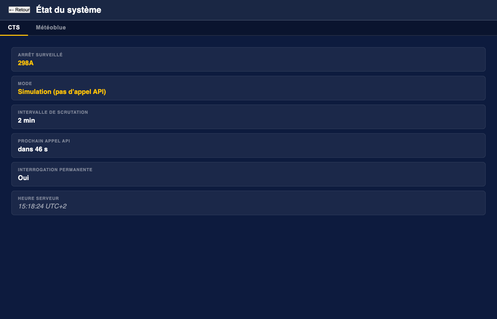
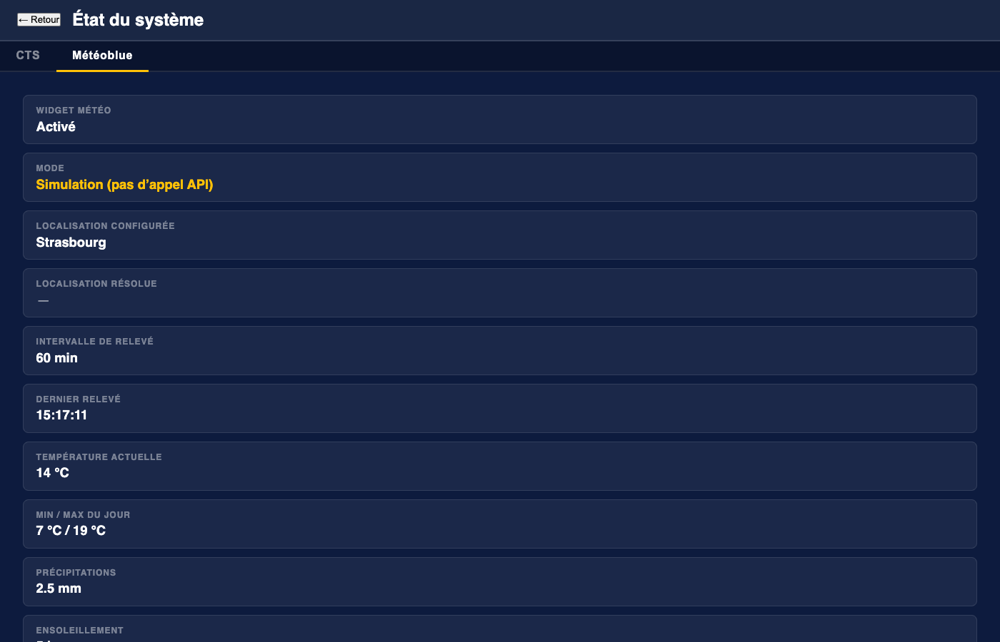

# CTS Departures

A real-time departure board for the **CTS** (Compagnie des Transports Strasbourgeois) network in Strasbourg, France.

The application polls the [CTS SIRI 2.0 API](https://www.cts-strasbourg.eu/fr/open-data/) and serves a live departure board to any browser over WebSocket — no page refresh needed. A single self-contained binary serves both the API and the embedded web UI.


| Mobile | Stop picker | Search |
|:---:|:---:|:---:|
|  |  |  |

| Status — CTS tab | Status — Météoblue tab |
|:---:|:---:|
|  |  |

---

## Features

- **Live departure board** — next two departures per line/direction, updated in real time via WebSocket
- **Real-time indicator** — bold times = GPS-confirmed, italic = theoretical schedule
- **Weather widget** — current conditions, daily min/max, precipitation, and sunshine hours in the board footer, powered by [Meteoblue](https://www.meteoblue.com/) (optional)
- **Stop picker** — browse all CTS stops and switch at runtime without restarting the server
- **Time-window gating** — restrict API polling to service hours (e.g. 6h–10h, 14h–18h, 22h–23h)
- **Independent simulation modes** — CTS and weather can each be simulated independently; no API keys needed for either
- **System status overlay** — tabbed view showing CTS polling state and Meteoblue weather status
- **Single binary** — web UI assets are embedded at compile time; deploy with one file copy
- **Responsive UI** — works on desktop, tablet, and mobile

---

## Requirements

- Rust 1.75+ (uses `async fn` in traits via AFIT)
- A CTS Open Data API token — free, request one at <https://www.cts-strasbourg.eu/fr/open-data/>
- *(Optional)* A [Meteoblue](https://www.meteoblue.com/en/weather-api) API key for the weather widget

---

## Build

### On the target machine (Linux aarch64)

```bash
# Development build
cargo build

# Optimised release build (smaller binary, LTO enabled)
cargo build --release
# or use the provided script:
./build_release.sh
```

The release binary is written to `target/release/cts-departures`.

### Cross-compiling from macOS (M1/M2/M3) → Freebox Delta / Linux aarch64

Even though both your Mac and the Freebox are ARM64, the Mac produces a
Mach-O binary (macOS) while the Freebox needs a Linux ELF. The solution is
[`cargo-zigbuild`](https://github.com/rust-cross/cargo-zigbuild): Zig ships
a built-in cross-linker — no Docker, no extra toolchain required.

**One-time setup:**
```bash
cargo install cargo-zigbuild
rustup target add aarch64-unknown-linux-musl
```

`zig` itself is downloaded automatically on first run. You can also install
it manually:
```bash
# macOS aarch64 pre-built binary
curl -fL https://ziglang.org/download/0.13.0/zig-macos-aarch64-0.13.0.tar.xz \
  | tar -xJ -C ~/.local/
export PATH="$HOME/.local/zig-0.13.0:$PATH"   # add to ~/.zshrc to make permanent
```

**Build & deploy:**
```bash
./build_freebox.sh
```

This produces a **fully static ELF binary** (no glibc dependency) in
`dist-freebox/` and prints the `scp` command to copy it to the Freebox.

```
dist-freebox/
├── cts-departures    ← statically linked Linux aarch64 ELF, ~3.4 MB
└── config.toml       ← pre-configured with listen_addr = 0.0.0.0:80
```

You can also run the cross-compilation step directly:
```bash
export PATH="$HOME/.local/zig-0.13.0:$PATH"
cargo zigbuild --target aarch64-unknown-linux-musl --release
# binary → target/aarch64-unknown-linux-musl/release/cts-departures
```

> **Why `musl` and not `gnu`?**
> `musl` produces a fully static binary with no runtime dependency on the
> Freebox's glibc version. Simpler to deploy, zero "wrong glibc" surprises.
> The binary is ~3.4 MB thanks to `opt-level = "s"` + `lto = true`.

---

## Configuration

Copy and edit `config.toml`. All CTS keys are prefixed `cts_`; weather keys are prefixed `meteoblue_`.

```toml
# ── CTS API ───────────────────────────────────────────────────────────────────

# Your CTS Open Data API token
cts_api_token = "xxxxxxxx-xxxx-xxxx-xxxx-xxxxxxxxxxxx"

# Logical stop code to monitor — find codes via the CTS stoppoints-discovery API
# Examples: "233A" = Homme de Fer,  "298A" = Jean Jaurès (direction Neuhof)
cts_monitoring_ref = "298A"

# API polling frequency in minutes
cts_polling_interval_minutes = 2

# Maximum departures to request per API call
cts_max_stop_visits = 10

# Web server address (use 0.0.0.0 to listen on all interfaces)
listen_addr = "0.0.0.0:3000"

# Set to true to use fake CTS data — no API key needed (see Demo mode below)
cts_simulation = false

# Restrict polling to service hours (set cts_always_query = false to enable)
cts_always_query = false
cts_query_intervals = "6:02-9:58;14:03-17:59;22:02-23:00"

# ── Meteoblue weather widget (optional) ──────────────────────────────────────

# meteoblue_enabled = true
# meteoblue_api_key = "YOUR_METEOBLUE_KEY"
# meteoblue_location = "Strasbourg"
# meteoblue_polling_interval_minutes = 60
# meteoblue_simulation = false
```

Alternatively, store the CTS token in a separate file and use:

```toml
cts_api_token_file = "/etc/cts/token"
```

---

## Run

```bash
# With the default config.toml
cargo run --release

# With a custom config file
cargo run --release -- /path/to/my-config.toml
```

Then open <http://localhost:3000> in your browser.

---

## Demo mode (no API keys required)

Both CTS and weather can be simulated independently. Set `cts_simulation = true` for fake departure data, and `meteoblue_simulation = true` for a fixed weather snapshot — neither makes any network calls to external APIs.

```toml
cts_api_token        = "demo"
cts_simulation       = true
cts_always_query     = true

meteoblue_enabled    = true
meteoblue_simulation = true
meteoblue_api_key    = "demo"
meteoblue_location   = "Strasbourg"
```

```bash
cargo run -- demo.toml
```

The board updates every minute with slightly jittered departure times so the countdown feels alive. The weather footer shows fixed plausible Strasbourg values (partly cloudy, 14 °C, 7/19 °C, 2.5 mm, 5 h sunshine).

---

## Weather widget

When `meteoblue_enabled = true`, the board footer shows a live weather strip:

```
☁  7°C / 19°C  💧 2.5 mm  ☀ 5 h
```

- The **city name** (`meteoblue_location`) is resolved to coordinates via the [Meteoblue location search API](https://www.meteoblue.com/) on startup — no need to look up latitude/longitude manually.
- Weather is polled every `meteoblue_polling_interval_minutes` minutes (default 60).
- When too many tram/bus lines are displayed and space is tight, the weather footer shrinks gracefully out of view — departure rows always take priority.
- Set `meteoblue_simulation = true` to show weather without an API key; useful for UI testing.

---

## Stop picker

Click the **Configuration** button in the header to browse all CTS stops and switch the monitored stop at runtime. The change is saved back to `config.toml` and a new poll is triggered immediately — no restart needed.

> **Note:** the stop list is fetched from the live CTS API even in simulation mode.

---

## System status

Click the **status dot** (●) in the header to open the system status overlay. It has two tabs:

- **CTS** — shows the monitored stop code, simulation flag, polling interval, time-window config, and the unix timestamp of the next scheduled poll.
- **Météoblue** — shows the resolved location name and coordinates, last fetch time, and the current weather values (pictocode, temperatures, precipitation, sunshine hours).

---

## REST & WebSocket API

| Endpoint | Description |
|---|---|
| `GET /ws` | WebSocket stream — pushes `DepartureBoard` JSON on every update |
| `GET /api/stops` | List all logical stops (sorted by name) |
| `GET /api/stops/:code/details` | Physical stops and line/directions under a logical code |
| `POST /api/config` | `{"monitoring_ref":"298B"}` — change stop at runtime |
| `GET /api/status` | Polling state, weather status, next poll timestamp |

---

## Project structure

```
src/
├── main.rs              Entry point and server startup
├── config.rs            TOML config loading and in-place updates
├── api/
│   ├── client.rs        CTS API client and poll loop
│   ├── model.rs         SIRI 2.0 data structures
│   └── simulation.rs    Offline fake-data generator
├── departure/
│   └── model.rs         API-agnostic DepartureBoard domain model
├── display/
│   ├── mod.rs           DisplayRenderer trait
│   └── web.rs           AppState, WebRenderer, WebSocket broadcast
├── server/
│   ├── router.rs        Axum routes and REST handlers
│   └── ws.rs            WebSocket connection lifecycle
└── weather/
    ├── mod.rs           Module entry
    ├── client.rs        Location resolution + weather poll loop
    ├── model.rs         Meteoblue API types and WeatherSnapshot
    └── simulation.rs    Fixed offline weather values
static/
├── index.html
├── app.js
└── style.css
```

See [ARCHITECTURE.md](ARCHITECTURE.md) for a full description of the data flow, concurrency model, and design decisions.

---

## License

BSD 2-Clause — see [LICENSE](LICENSE).
