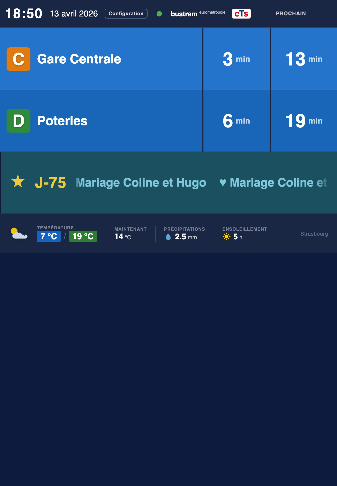
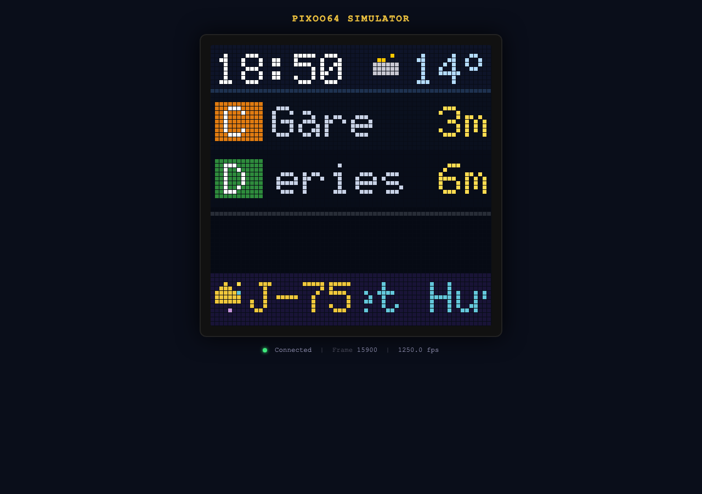
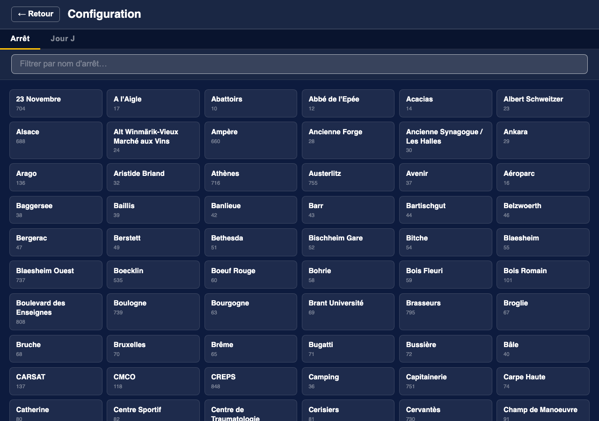
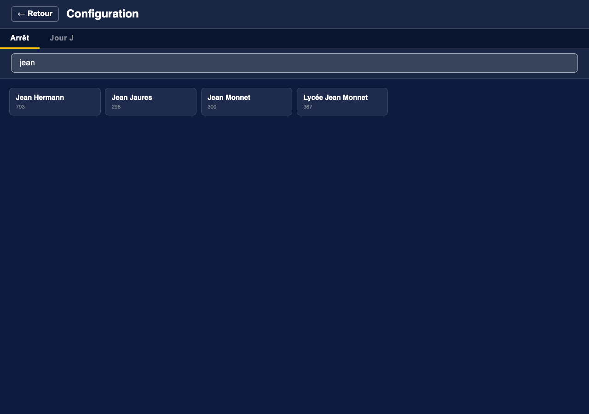
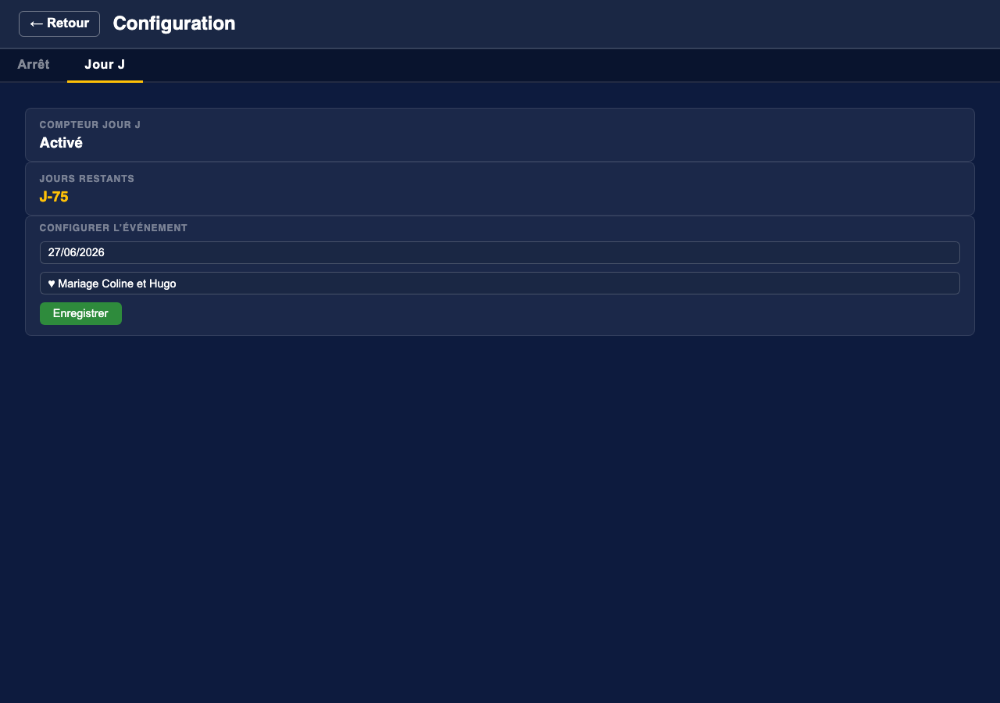

# CTS Departures

A real-time departure board for the **CTS** (Compagnie des Transports Strasbourgeois) network in Strasbourg, France.

The application polls the [CTS SIRI 2.0 API](https://www.cts-strasbourg.eu/fr/open-data/) and serves a live departure board to any browser over WebSocket — no page refresh needed. It can also drive a **Divoom Pixoo64** 64×64 LED display. A single self-contained binary serves both the API and the embedded web UI.


| iPad | Status — CTS | Status — Météoblue |
|:---:|:---:|:---:|
|  |  |  |



| Config — Arrêt | Config — Recherche | Config — Compteur J |
|:---:|:---:|:---:|
|  |  |  |

---

## Features

- **Live departure board** — next two departures per line/direction, updated in real time via WebSocket
- **Real-time indicator** — bold times = GPS-confirmed, italic = theoretical schedule
- **Weather widget** — current conditions, daily min/max, precipitation, and sunshine hours in the board footer, powered by [Meteoblue](https://www.meteoblue.com/) (optional)
- **Birthday of the day** — reads a JSON file of contacts and displays today's birthdays with age, when board space permits
- **Jour J countdown** — shows days remaining to any event you configure; date and label are editable from the web UI at runtime
- **Pixoo64 LED display** — renders the departure board on a Divoom Pixoo64 64×64 LED matrix, with scrolling destination text, birthday row, and Jour J row
- **Stop picker** — browse all CTS stops and switch at runtime without restarting the server
- **Crontab-style query windows** — restrict API polling to specific hours or days using 5-field crontab expressions, supporting different schedules for weekdays vs. weekends
- **Independent simulation modes** — CTS and weather can each be simulated independently; no API keys needed for either
- **System status overlay** — tabbed view showing CTS polling state, Meteoblue weather status, and the Jour J counter configuration
- **Single binary** — web UI assets are embedded at compile time; deploy with one file copy
- **Responsive UI** — works on desktop, tablet, and mobile

---

## Requirements

- Rust 1.75+ (uses `async fn` in traits via AFIT)
- A CTS Open Data API token — free, request one at <https://www.cts-strasbourg.eu/fr/open-data/>
- *(Optional)* A [Meteoblue](https://www.meteoblue.com/en/weather-api) API key for the weather widget
- *(Optional)* A Divoom Pixoo64 device for the LED display

---

## Build

### On the target machine (Linux aarch64)

```bash
# Development build
cargo build

# Optimised release build (smaller binary, LTO enabled)
cargo build --release
# or use the provided script:
./build_release.sh
```

The release binary is written to `target/release/cts-departures`.

### Cross-compiling from macOS (M1/M2/M3) → Freebox Delta / Linux aarch64

Even though both your Mac and the Freebox are ARM64, the Mac produces a
Mach-O binary (macOS) while the Freebox needs a Linux ELF. The solution is
[`cargo-zigbuild`](https://github.com/rust-cross/cargo-zigbuild): Zig ships
a built-in cross-linker — no Docker, no extra toolchain required.

**One-time setup:**
```bash
cargo install cargo-zigbuild
rustup target add aarch64-unknown-linux-musl
```

`zig` itself is downloaded automatically on first run. You can also install
it manually:
```bash
# macOS aarch64 pre-built binary
curl -fL https://ziglang.org/download/0.13.0/zig-macos-aarch64-0.13.0.tar.xz \
  | tar -xJ -C ~/.local/
export PATH="$HOME/.local/zig-0.13.0:$PATH"   # add to ~/.zshrc to make permanent
```

**Build & deploy:**
```bash
./build_freebox.sh
```

This produces a **fully static ELF binary** (no glibc dependency) in
`dist-freebox/` and prints the `scp` command to copy it to the Freebox.

```
dist-freebox/
├── cts-departures    ← statically linked Linux aarch64 ELF, ~3.4 MB
└── config.toml       ← pre-configured with listen_addr = 0.0.0.0:80
```

> **Why `musl` and not `gnu`?**
> `musl` produces a fully static binary with no runtime dependency on the
> Freebox's glibc version. Simpler to deploy, zero "wrong glibc" surprises.
> The binary is ~3.4 MB thanks to `opt-level = "s"` + `lto = true`.

---

## Configuration

Copy and edit `config.toml`. All CTS keys are prefixed `cts_`, weather keys `meteoblue_`, and LED display keys `pixoo64_`.

```toml
# ── CTS API ───────────────────────────────────────────────────────────────────

# Your CTS Open Data API token
cts_api_token = "xxxxxxxx-xxxx-xxxx-xxxx-xxxxxxxxxxxx"

# Logical stop code to monitor — find codes via the CTS stoppoints-discovery API
# Examples: "233A" = Homme de Fer,  "298B" = Jean Jaurès (direction Gare Centrale)
cts_monitoring_ref = "298B"

# API polling frequency in minutes
cts_polling_interval_minutes = 2

# Maximum departures to request per API call
cts_max_stop_visits = 10

# Web server address (use 0.0.0.0 to listen on all interfaces)
listen_addr = "0.0.0.0:3000"

# Set to true to use fake CTS data — no API key needed (see Demo mode below)
cts_simulation = false

# Restrict polling to service hours using 5-field crontab expressions.
# Semicolons separate multiple clauses; polling occurs when ANY clause matches.
# Day-of-week: 0 = Sunday … 6 = Saturday
# Examples:
#   Every day 6 h–23 h:                 "* 6-23 * * *"
#   Weekdays 6h–23h, weekends 8h–23h:   "* 6-23 * * 1-5; * 8-23 * * 0,6"
#   Morning + afternoon + evening:      "* 6-9,14-18,22-23 * * *"
cts_always_query = false
cts_query_intervals = "* 6-9,14-17,22-23 * * 1-5; * 6-23 * * 0,6"

# ── Meteoblue weather widget (optional) ──────────────────────────────────────

# meteoblue_enabled = true
# meteoblue_api_key = "YOUR_METEOBLUE_KEY"
# meteoblue_location = "Strasbourg"
# meteoblue_polling_interval_minutes = 60
# meteoblue_simulation = false

# meteoblue_always_query = true   # set false to gate weather polling to a time window
# meteoblue_query_intervals = "* 6-23 * * *"   # same crontab syntax as cts_query_intervals

# ── Divoom Pixoo64 LED display (optional) ────────────────────────────────────

# pixoo64_enabled = true
# pixoo64_address = "192.168.1.42"
# pixoo64_simulation = true         # render PNG preview only, no device calls
# pixoo64_refresh_interval_seconds = 5

# ── Birthday feature (optional) ───────────────────────────────────────────────

# birthday_enabled = true
# birthday_file = "data/birthdays.json"

# ── Jour J countdown (optional) ───────────────────────────────────────────────

# jour_j_enabled = true
# jour_j_date = "25/12/2026"
# jour_j_label = "Noël"
```

Alternatively, store API keys in separate files:

```toml
cts_api_token_file      = "/etc/cts/token"
meteoblue_api_key_file  = "/etc/cts/meteoblue_key"
```

---

## Run

```bash
# With the default config.toml
cargo run --release

# With a custom config file
cargo run --release -- /path/to/my-config.toml
```

Then open <http://localhost:3000> in your browser.

---

## Demo mode (no API keys required)

Both CTS and weather can be simulated independently. Use `demo.toml` for a fully self-contained demo:

```bash
cargo run -- demo.toml
```

`demo.toml` enables simulated CTS departures, simulated weather, birthday display, and a Jour J countdown. Set `cts_demo_lines` to control how many departure rows appear (1–4), leaving room for birthday and Jour J rows.

```toml
cts_api_token        = "demo"
cts_simulation       = true
cts_always_query     = true
cts_demo_lines       = 2        # show 2 lines; leaves room for birthday + Jour J below

meteoblue_enabled    = true
meteoblue_simulation = true
meteoblue_api_key    = "demo"
meteoblue_location   = "Strasbourg"

birthday_enabled     = true
birthday_file        = "data/birthdays.json"

jour_j_enabled       = true
jour_j_date          = "27/06/2026"
jour_j_label         = "♥ Mariage Coline et Hugo"
```

The board updates every polling interval with slightly jittered departure times so the countdown feels alive.

---

## Weather widget

When `meteoblue_enabled = true`, the board footer shows a live weather strip:

```
☁  7°C / 19°C  💧 2.5 mm  ☀ 5 h
```

- The **city name** (`meteoblue_location`) is resolved to coordinates via the Meteoblue location search API on startup — no need to supply latitude/longitude manually.
- Weather is polled every `meteoblue_polling_interval_minutes` minutes (default 60).
- When too many departure rows are displayed and space is tight, the weather footer shrinks gracefully — departure rows always take priority.
- Use `meteoblue_always_query = false` with `meteoblue_query_intervals` to restrict weather polling to specific hours (same crontab syntax as for CTS).
- Set `meteoblue_simulation = true` to show weather without an API key.

---

## Birthday of the day

When `birthday_enabled = true`, today's birthdays are loaded from a JSON file and shown on the board (both web and Pixoo64) whenever fewer than 4 departure rows are displayed.

**Format** (`data/birthdays.json`):
```json
{
  "birthdays": [
    { "name": "Jean Martin",   "date": "12/04" },
    { "name": "Claire Dupont", "date": "03/07/1985" }
  ]
}
```

- Date format: `DD/MM` (annual, no year) or `DD/MM/YYYY` (age is calculated automatically and shown in parentheses).
- Multiple entries for the same date are all displayed, scrolling across the board.
 
## Jour J countdown

When `jour_j_enabled = true`, the board shows a countdown in days to the configured event. The date and label can be updated at runtime from the web UI without restarting the server:

1. Click the **status dot** (●) in the header.
2. Select the **Compteur J** tab.
3. Enter a date (DD/MM/YYYY) and label, then click **Enregistrer**.

The new values are saved back to `config.toml` and take effect immediately.

---

## Pixoo64 LED display

When `pixoo64_enabled = true`, the board is rendered every `pixoo64_refresh_interval_seconds` seconds on a Divoom Pixoo64 64×64 LED matrix.

- **Scrolling destination names** — text too wide for the 32-pixel destination area scrolls continuously.
- **Birthday row** — shown below departure rows when fewer than 4 lines are displayed.
- **Jour J row** — shown below the birthday row when fewer than 3 lines are displayed.
- **Simulation mode** — set `pixoo64_simulation = true` to render a PNG preview served at `/api/pixoo64/preview` without sending anything to the device. Useful for layout development.

A web-based Pixoo64 simulator is available at <https://github.com/jib63/pixoo64-simulator> — it replicates the device display in the browser and can receive frames from this application.

---

## Stop picker

Click the **Configuration** button in the header to browse all CTS stops and switch the monitored stop at runtime. The change is saved back to `config.toml` and a new poll is triggered immediately — no restart needed.

> **Note:** the stop list is fetched from the live CTS API even in simulation mode.

---

## System status

Click the **status dot** (●) in the header to open the system status overlay. It has three tabs:

- **CTS** — monitored stop code, simulation flag, polling interval, crontab window config, and the timestamp of the next scheduled poll.
- **Météoblue** — resolved location name and coordinates, last fetch time, current weather values, and query window status.
- **Compteur J** — current event date and label; edit form to update both at runtime.

---

## REST & WebSocket API

| Endpoint | Description |
|---|---|
| `GET /ws` | WebSocket stream — pushes `DepartureBoard` JSON on every update |
| `GET /api/stops` | List all logical stops (sorted by name) |
| `GET /api/stops/:code/details` | Physical stops and line/directions under a logical code |
| `POST /api/config` | `{"monitoring_ref":"298B"}` — change stop at runtime |
| `POST /api/jour-j` | `{"date":"DD/MM/YYYY","label":"…"}` — update Jour J config at runtime |
| `GET /api/status` | Polling state, weather status, Jour J config |
| `GET /api/pixoo64/preview` | Latest Pixoo64 frame as PNG (simulation mode only) |

---

## Project structure

```
src/
├── main.rs              Entry point and server startup
├── config.rs            TOML config loading and in-place updates
├── cts/
│   ├── client.rs        CTS API client and poll loop
│   ├── model.rs         SIRI 2.0 data structures
│   └── simulation.rs    Fake departure data generator
├── departure/
│   └── model.rs         API-agnostic DepartureBoard domain model
├── display/
│   └── mod.rs           DisplayRenderer trait
├── meteoblue/
│   ├── client.rs        Location resolution + weather poll loop
│   ├── model.rs         Meteoblue API types and WeatherSnapshot
│   └── simulation.rs    Fixed offline weather values
├── pixoo64/
│   ├── draw.rs          Frame renderer (departures, weather, birthday, Jour J)
│   ├── font.rs          Embedded 5×7 bitmap font
│   └── renderer.rs      Pixoo64 HTTP client and DisplayRenderer impl
└── web/
    ├── mod.rs           AppState, CronMatcher, interval parsing
    ├── router.rs        Axum routes and REST handlers
    └── ws.rs            WebSocket connection lifecycle
static/
├── index.html
├── app.js
└── style.css
data/
└── birthdays.json       Birthday list (DD/MM or DD/MM/YYYY format)
export_birthdays.applescript   macOS Contacts → birthdays.json exporter
```

See [ARCHITECTURE.md](ARCHITECTURE.md) for a full description of the data flow, concurrency model, and design decisions.

---

## License

MIT — see [LICENSE](LICENSE).
