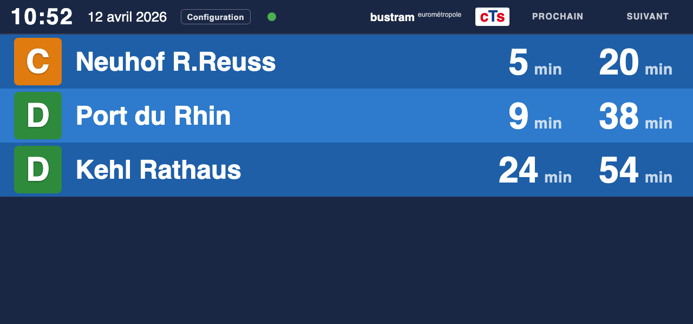
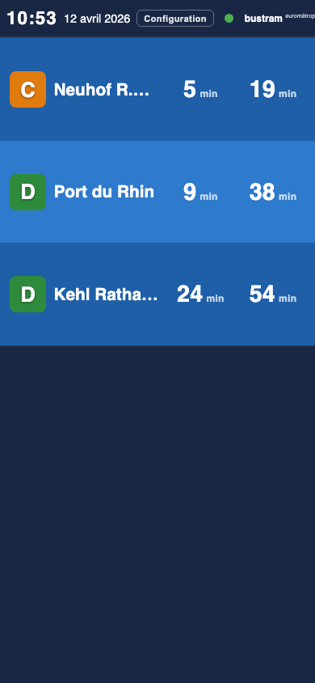
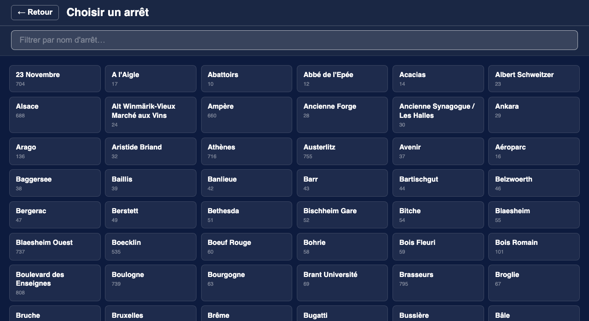
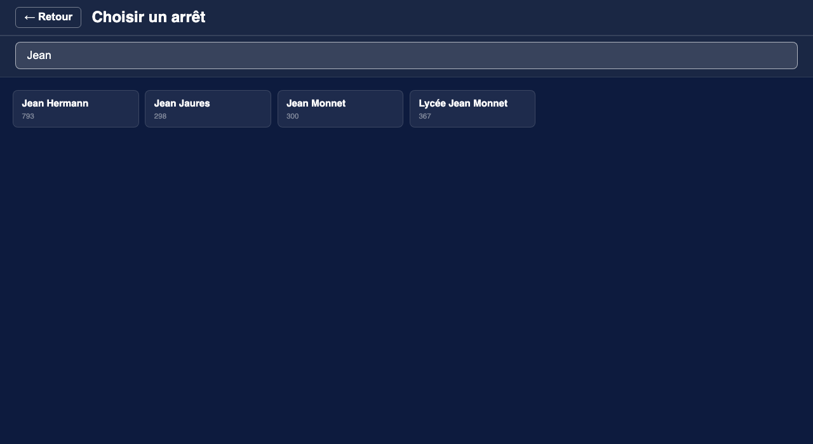

# CTS Departures

A real-time departure board for the **CTS** (Compagnie des Transports Strasbourgeois) network in Strasbourg, France.

The application polls the [CTS SIRI 2.0 API](https://www.cts-strasbourg.eu/fr/open-data/) and serves a live departure board to any browser over WebSocket — no page refresh needed. A single self-contained binary serves both the API and the embedded web UI.



| Mobile | Stop picker | Search |
|:---:|:---:|:---:|
|  |  |  |

---

## Features

- **Live departure board** — next two departures per line/direction, updated in real time via WebSocket
- **Real-time indicator** — bold times = GPS-confirmed, italic = theoretical schedule
- **Stop picker** — browse all CTS stops and switch at runtime without restarting the server
- **Time-window gating** — restrict API polling to service hours (e.g. 6h–10h, 14h–18h, 22h–23h)
- **Simulation mode** — fully functional demo without an API key (see below)
- **Single binary** — web UI assets are embedded at compile time; deploy with one file copy
- **Responsive UI** — works on desktop, tablet, and mobile

---

## Requirements

- Rust 1.75+ (uses `async fn` in traits via AFIT)
- A CTS Open Data API token — free, request one at <https://www.cts-strasbourg.eu/fr/open-data/>

---

## Build

```bash
# Development build
cargo build

# Optimised release build (smaller binary, LTO enabled)
cargo build --release
# or use the provided script:
./build_release.sh
```

The release binary is written to `target/release/cts-departures`.

---

## Configuration

Copy and edit `config.toml`:

```toml
# Your CTS Open Data API token
api_token = "xxxxxxxx-xxxx-xxxx-xxxx-xxxxxxxxxxxx"

# Logical stop code to monitor — find codes via the CTS stoppoints-discovery API
# Examples: "233A" = Homme de Fer,  "298A" = Jean Jaurès (direction Neuhof)
monitoring_ref = "298A"

# API polling frequency in minutes
polling_interval_minutes = 2

# Maximum departures to request per API call
max_stop_visits = 10

# Web server address (use 0.0.0.0 to listen on all interfaces)
listen_addr = "0.0.0.0:3000"

# Set to true to use fake data — no API key needed (see Demo mode below)
simulation = false

# Restrict polling to service hours (set always_query = false to enable)
always_query = false
query_intervals = "6:02-9:58;14:03-17:59;22:02-23:00"
```

Alternatively, store the token in a separate file and use:

```toml
api_token_file = "/etc/cts/token"
```

---

## Run

```bash
# With the default config.toml
cargo run --release

# With a custom config file
cargo run --release -- /path/to/my-config.toml
```

Then open <http://localhost:3000> in your browser.

---

## Demo mode (no API key required)

Set `simulation = true` in your config to generate realistic fake departure data locally. No network calls are made to the CTS API.

```toml
api_token   = "demo"      # any non-empty string
simulation  = true
always_query = true
```

```bash
cargo run -- demo.toml
```

The board updates every minute with slightly jittered departure times so the countdown feels alive.

---

## Stop picker

Click the **Configuration** button in the header to browse all CTS stops and switch the monitored stop at runtime. The change is saved back to `config.toml` and a new poll is triggered immediately — no restart needed.

> **Note:** the stop list is fetched from the live CTS API even in simulation mode.

---

## REST & WebSocket API

| Endpoint | Description |
|---|---|
| `GET /ws` | WebSocket stream — pushes `DepartureBoard` JSON on every update |
| `GET /api/stops` | List all logical stops (sorted by name) |
| `GET /api/stops/:code/details` | Physical stops and line/directions under a logical code |
| `POST /api/config` | `{"monitoring_ref":"298B"}` — change stop at runtime |
| `GET /api/status` | Polling state, time window, next poll timestamp |

---

## Project structure

```
src/
├── main.rs              Entry point and server startup
├── config.rs            TOML config loading and in-place updates
├── api/
│   ├── client.rs        CTS API client and poll loop
│   ├── model.rs         SIRI 2.0 data structures
│   └── simulation.rs    Offline fake-data generator
├── departure/
│   └── model.rs         API-agnostic DepartureBoard domain model
├── display/
│   ├── mod.rs           DisplayRenderer trait
│   └── web.rs           AppState, WebRenderer, WebSocket broadcast
└── server/
    ├── router.rs        Axum routes and REST handlers
    └── ws.rs            WebSocket connection lifecycle
static/
├── index.html
├── app.js
└── style.css
```

See [ARCHITECTURE.md](ARCHITECTURE.md) for a full description of the data flow, concurrency model, and design decisions.

---

## License

BSD 2-Clause — see [LICENSE](LICENSE).
